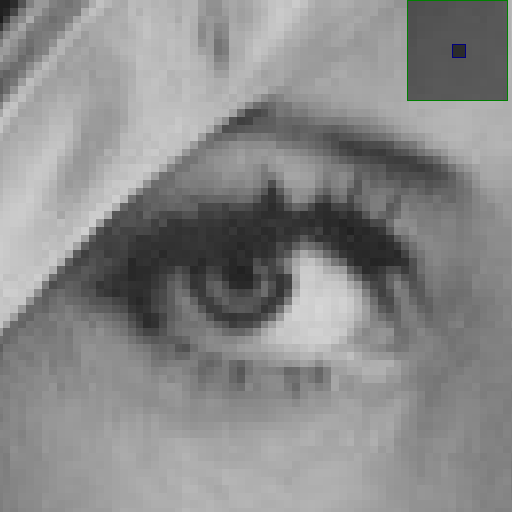
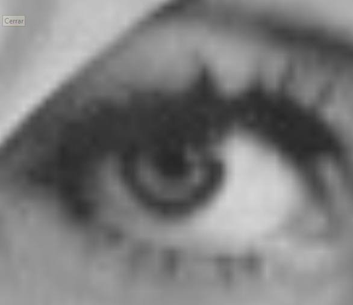

# Image Interpolation

This project demonstrates the use of interpolation techniques for scaling images to higher resolutions. The objective is to showcase how mathematical interpolation methods can enhance image quality when scaling or zooming into an image.

**Note:** This project is not intended for production use, and certain edge cases may not be fully handled. There are several bugs that I intend to fix in the future.

**Disclaimer**: For the moment, the project only supports images in grayscale. 
## Demo preview
https://github.com/user-attachments/assets/2478b729-3931-44bb-b35f-12f87bdb86bf

## Interpolation Methods

Currently, the project supports the following interpolation techniques:

1. **Nearest Neighbor**  
2. **Bilinear**  
3. **Bicubic** *(not yet implemented)*  
4. **Splines** *(not yet implemented)*  

## Example

When scaling an image, the lack of detail becomes evident due to limited resolution. For instance, given this image:

Zooming into a specific area, such as the eye, reveals pixelation. This is expected, as the resolution of the image does not contain enough detail to support higher zoom levels:

By applying interpolation to the zoomed section, the resolution is effectively upscaled, generating new pixels to fill in the gaps. Below is the result of using **bilinear interpolation**, which computes intermediate values by linearly interpolating along both dimensions:

In this case, interpolation improves the visual quality of the zoomed section by estimating the missing data.

## How to Use the Application

1. **Prerequisite**: Ensure Python is installed on your system.
2. **Run the script**: Launch the application by executing the script in a Python environment.

### Steps:

1. Once the application is open, select an image from your local storage.
2. After the image is loaded, press the "Select" button to define an area of interest.
3. Click and drag the mouse over the desired portion of the image. Releasing the mouse button will confirm the selection.
4. The selected area will then be scaled using the default interpolation method (**bilinear interpolation** by default).

A new window will display the upscaled result of the selected portion.

### Note:

To change the interpolation method, modify the `interpolate` function in `main.py`. Future updates may include a graphical interface to allow method selection.

## Future Improvements
- Use GPU for better time on matrix operations 
- Implementing **bicubic** and **spline** interpolation methods.
- Improving user interface (kinda poor right now, not really into UIs)
- Adding a user interface option for selecting interpolation methods.
- Optimizing edge case handling for various image resolutions and types.
